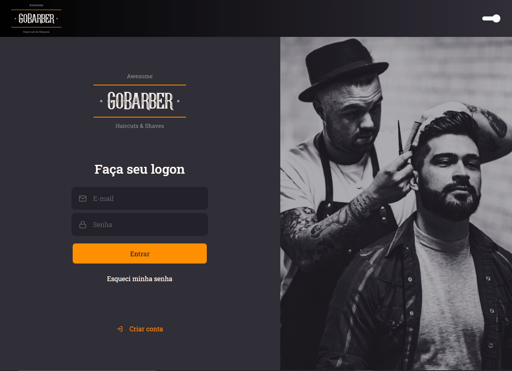
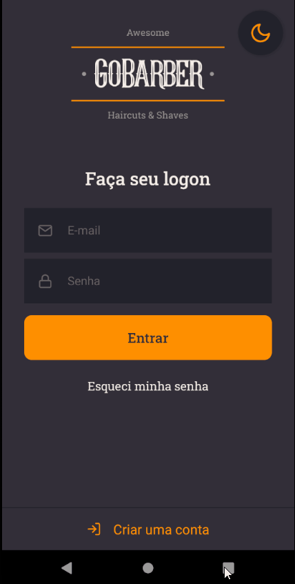

<h1 align="center">
  
</h1>

The best way to schedule your service!

## 💇🏻‍♂️ About the project

This api provides everything needed to organize appointments between the barbers and customers.

Customers can choose the best time available to them.

Providers can see all their appointments, manage the times, also see if one client canceled the schedule.

---

  
  

To see the **web client**, click here: [GoBarber Web](https://github.com/ARTHURPC03/New-GoBarber-Web) 
To see the **mobile client**, click here: [GoBarber Mobile](https://github.com/ARTHURPC03/AppNewGoBarber)

## 🚀 Technologies

- [Node.js](https://nodejs.org/en/)
- [TypeScript](https://www.typescriptlang.org/)
- [Express](https://expressjs.com/pt-br/)
- [Multer](https://github.com/expressjs/multer)
- [TypeORM](https://typeorm.io/#/)
- [JWT-token](https://jwt.io/)
- [uuid v4](https://github.com/thenativeweb/uuidv4/)
- [PostgreSQL](https://www.postgresql.org/)
- [Date-fns](https://date-fns.org/)
- [Jest](https://jestjs.io/)
- [Eslint](https://eslint.org/)
- [Prettier](https://prettier.io/)
- [EditorConfig](https://editorconfig.org/)

Made with 💜 by ARTHUR PC 👋 [See my linkedin](https://www.linkedin.com/in/arthurpc03/)
 
 [See my youtube channel](https://www.youtube.com/c/arthurpc)
